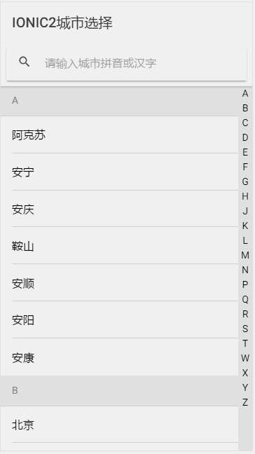
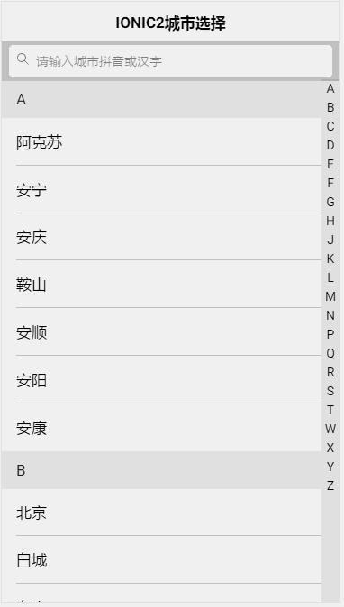

Ionic 2 City Index Select
=====================

## Using this project

You'll need the Ionic CLI with support for v2 apps:

```bash
$ npm install -g ionic
```

Then run:

```bash
$ cnpm install
```

Then run:

```bash
$ ionic serve
```

Wp效果  
  

Android效果  
  

iOS效果  
  


======如果此项目对您有所帮助，请点下面橙色的按钮，谢谢！  =======